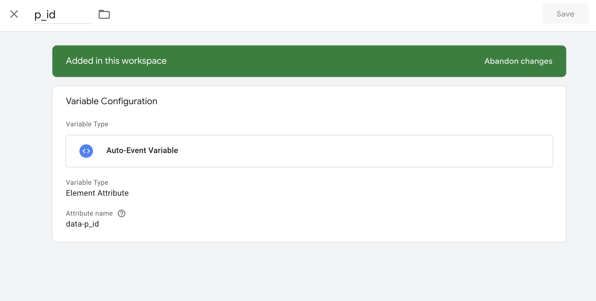
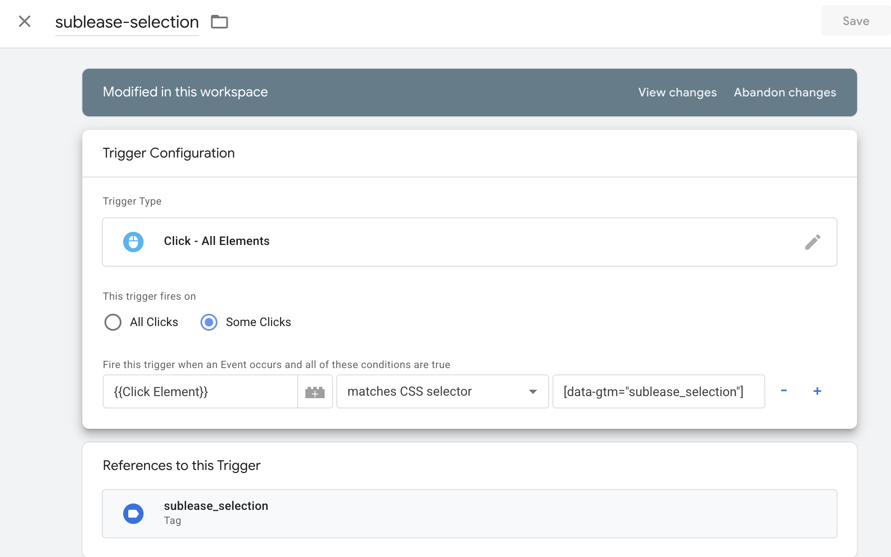
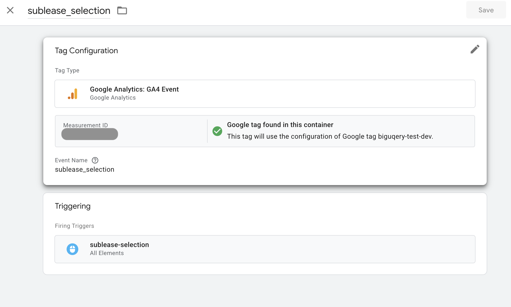

# ① BigQuery Emulator

## 1. 目的
- BigQuery Emulatorを使って以下を実施
  - DDLによるテーブル作成
  - テストデータ(JSON形式)のデータ挿入
  - アプリ側でのデータ表示


## 2. セットアップ => 動作確認

1. **Docker Emulator 起動**  
   ```bash
   pnpm emu:up
   ```
＊Docker imageは `ghcr.io/goccy/bigquery-emulator:latest`を使用 (Google公式ではないが、Bigquery Emulatorでよく使用されている)
- データ参照: 

2. **初期化スクリプト実行**  
   ```bash
   pnpm emu:init
   ```
   - app_dataset を autoCreate
   - スキーマとサンプルデータ挿入 (db/dev/*)

※データ確認したい場合)
   ```bash
   pnpm emu:query "SELECT * FROM app_dataset.contractor_list"
   ```

3. **Nuxt 開発サーバー起動**  
   ```bash
   pnpm run dev
   ```

4. **ブラウザで動作確認**  
   - 契約者情報が表示されることを確認

## 3. 課題と対策
- 課題1
   - 課題
      - Bigquery Emulatorはパーティション／クラスタリング未対応のためエラーが発生
   - 対策
      - ローカル開発ではパーティションありでのテーブル作成は実施しない。
- 課題2
   - 課題
      - データセット自動生成ができない
   - 対策
      - `dataset('app_dataset').get({autoCreate:true})` を実行し、データセット生成

## 4. 設定詳細
- ローカルとSTG/PRODでの処理分岐:
   - `const isDev = process.env.NODE_ENV === 'development'`でlocalのみEmulatorを使用
   - サービスアカウント: Emulatorは認証不要。スクリプト内で `makeAuthenticatedRequestFactory({})` でバイパス。

-----------

# ② GTM(Google Tag Manager)・GA4 (Google Analytics 4) のローカルテスト

## 1. 目的
- ローカル開発環境でアプリケーションを起動し、ボタンクリックなどの特定のアクションが GTM や GA4 で正しく計測されることを確認

## 2. セットアップ → 動作確認

### 2-1. GA4 管理画面設定

- Account > Property作成
- Admin ▸ Data Streams ▸ Web → 対象ストリームを開く
- Website URL: STG・PRODにリリース済みの場合はトップページのURL。未リリース時は`http://local.test`などdev用のURLを使用
- Measurement ID: `G-YYYYYYYY` をメモ (GTMの設定で使用する)

### 2-2. GTM 管理画面設定

1. コンテナ作成／選択
   - GTM ID（例: GTM-XXXXXXX）を確認

2. 変数設定


3. トリガー設定


3. タグ設定

- Measurement ID: GA4の設定で取得したID (ADMIN > Datastream > Web stream detailsから確認可能)

4. 公開
 - Submit → Publish して公開版を反映

### 2-3. アプリ側の設定 & 動作確認

1. **ローカル起動**
   ```bash
   pnpm run dev
   ```

2. **GTM Preview → Connect**
   - URL に `http://localhost:3000` を入力

3. **ブラウザで対象アクションを実施**
   - タブ切替やボタンクリック → Tag Assistant の “Tags Fired” に反映

4. **GTM の “Tags Fired” を確認**
   - 対象アクションが実行されたことを確認

5. **GA4で対象イベントのログデータ を確認**
   - ADMIN > Data Display > DebugView: Debug イベントを確認
   - Report > Realtime Overview: リアルタイムでのイベントを確認

## 3. 課題と対策
- 課題1
   - 課題
      - PrimevueのButtonコンポーネントは、標準のHTMLボタンと異なり、内部にspanタグが含まれる実装になっている。
      - 当初、ButtonとGTMのTrigger以下のように設定していた。

      ```bash
      <Button
            label="XXX"
            :data-gtm="'property_confirmation'"
            :data-p-id="'1'"
            :data-dest-id="'1'"
            :data-action-type="ACTION_TYPE.CONFIRM_BUTTON"
      />
      ```

      ```bash
      GTM > Trigger
      [data-gtm="sublease_selection"]
      ```
      - 上記だと、内部の<span>タグから変数値が取得できずに失敗。
      - Button全体に属性を付加するだけでは内部の各要素までは管理できないというPrimevue Buttonの特性によるものだと判明。
   - 対策
      - Buttonコンポーネント内にspanタグを配置し、そのspanタグに属性を設定する。
      ```bash
      <Button>
         <span
         :data-gtm="'property_confirmation'"
         :data-p-id="'1'"
         :data-dest-id="'1'"
         :data-action-type="ACTION_TYPE.CONFIRM_BUTTON"
         >
         XXX
         </span>
      </Button>
      ```

-----------------------------------
▼参考文献
- [GTMでクリック計測にカスタムデータ属性を使う方法](https://hep.eiz.jp/article/gtm-custom-data-attribute/)
- [Googleアナリティクス4（GA4）のDebugView完全ガイド！実用シーン、設定方法、活用ポイントを詳しく解説](https://www.data-be.at/magazine/ga4-debugview/)
- [GA4でクリックイベントを計測する方法｜計測設定から探索レポートでの確認方法まで解説](https://blog.siteanatomy.com/ga4-clickevent)
- [@zadigetvoltaire/nuxt-gtm](https://nuxt.com/modules/nuxt-gtm)
