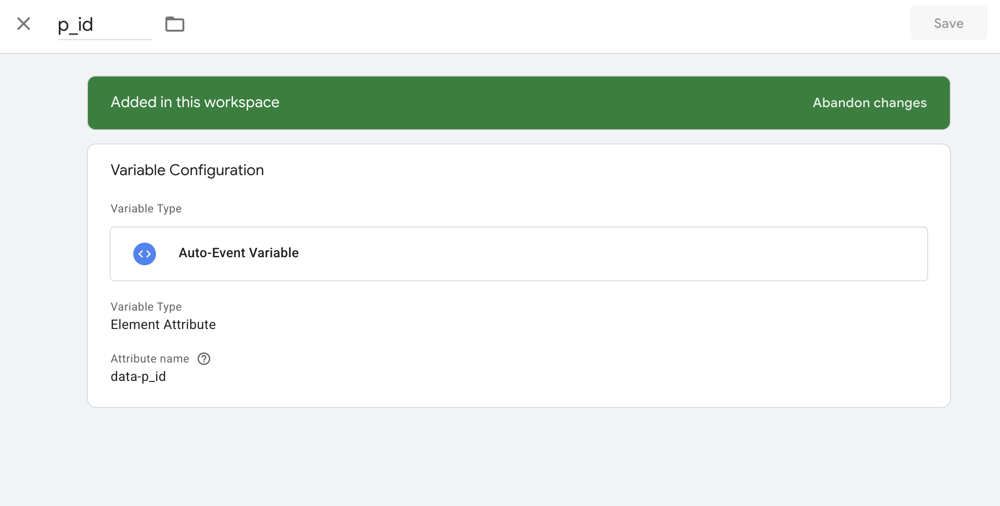
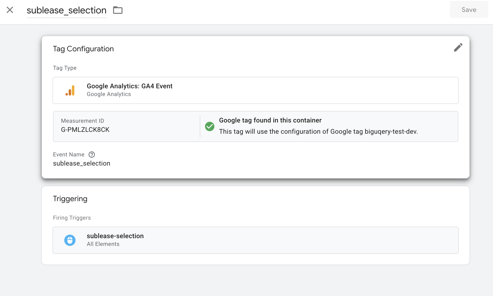

# ① BigQuery Emulator

## 1. 目的
- BigQuery Emulatorを使って以下を実施
  - DDLによるテーブル作成
  - テストデータ(JSON形式)のデータ挿入
  - アプリ側でのデータ表示


## 2. セットアップ => 動作確認

1. ライブラリインストール
   ```bash
   @google-cloud/bigquery
   ```

2. **Docker Emulator 起動**  
   ```bash
   pnpm emu:up
   ```
＊Docker imageは `ghcr.io/goccy/bigquery-emulator:latest`を使用 (Google公式ではないが、Bigquery Emulatorでよく使用されている)
- データ参照: 

3. **初期化スクリプト実行**  
   ```bash
   pnpm emu:init
   ```
   - app_dataset を autoCreate
   - db/dev/schema.sql でテーブル作成
   - db/dev/data.sql でサンプル投入

4. **Nuxt 開発サーバー起動**  
   ```bash
   pnpm run dev
   ```

5. **動作確認**  
   - http://localhost:3000で契約者情報の確認

## 3. 課題と対策

| 課題| 対策|
--------------------------------------------------------------------------------------------------- | ------------------------------------------------------------------------------------------------------ |
| **パーティション／クラスタリング未対応**<br>`CREATE TABLE … PARTITION BY…` がエラー                 | ローカルではパーティションありでのテーブル作成は現状難しそう (partition 対応のfork版を試したが不安定だった) |
| データセット自動生成ができない                                | スクリプトで `dataset('app_dataset').get({autoCreate:true})` を実行                                    |
|

## 4. 設定詳細
- ローカルとSTG/PRODでの処理の分け方:
  - `const useEmulator = isDev && !!BQ_EMULATOR_HOST`でlocalのみuseEmulatorを使用
- サービスアカウント: エミュレータは認証不要。スクリプト内で `makeAuthenticatedRequestFactory({})` でバイパス。

-----------

# ② GTM・GA4 のローカルテスト

## 1. 目的
- ローカル（http://localhost:3000）で起動したアプリ上でGTM や GA4 の動作確認

## 2. セットアップ → 動作確認

### 2-1. GA4 管理画面設定

- Account > Property作成
- Admin ▸ Data Streams ▸ Web → 対象ストリームを開く
- Website URL: STG・PRODにリリース済みの場合はindexページのURL。未リリース時は`http://local.test`などdev用のURLを登録
- Measurement ID: `G-YYYYYYYY` をメモ

### 2-2. GTM 管理画面設定

1. コンテナ作成／選択
   - GTM ID（例: GTM-XXXXXXX）を確認

2. 変数設定  


3. トリガー設定


3. タグ設定

- Measurement ID: GA4の設定で取得したID (ADMIN > Datastream > Web stream detailsから確認可能)

4. 公開
 - Submit → Publish して公開版を反映

### 2-3. アプリ側の設定 & 動作確認

1. **ローカル起動**
   ```bash
   pnpm run dev
   ```

2. **GTM Preview → Connect**
   - Tag Assistant で URL に `http://localhost:3000` を入力

3. **ブラウザで操作**
   - タブ切替やボタンクリック → Tag Assistant の “Tags Fired” に `sublease_selection` が表示

4. **GA4 DebugView & Realtime**
   - ADMIN > Data Display > DebugView: Debug イベントを確認
   - Report > Realtime Overview

## 3. 課題

- BigQuery 自動エクスポート は未検証
- STG/PROD 環境 での動作確認はまだ
- PrimeVue Button の属性透過  
  label prop 使用時は内層 `<span>` がクリック対象となり、  
  トリガー設定で `[data-gtm="…"]` だけだと Tag が発火しない。  
  → `[data-gtm="sublease_selection"], [data-gtm="sublease_selection"] *` のようにワイルドカードを使うことで、内包要素のクリックも拾える。

## 4. 設定詳細

- `@zadigetvoltaire/nuxt-gtm`を使用
- `nuxt.config.ts`でgtmのconfig設定

-----------------------------------
▼参考文献
- [GTMでクリック計測にカスタムデータ属性を使う方法](https://hep.eiz.jp/article/gtm-custom-data-attribute/)
- [Googleアナリティクス4（GA4）のDebugView完全ガイド！実用シーン、設定方法、活用ポイントを詳しく解説](https://www.data-be.at/magazine/ga4-debugview/)
- [GA4でクリックイベントを計測する方法｜計測設定から探索レポートでの確認方法まで解説](https://blog.siteanatomy.com/ga4-clickevent)
- [@zadigetvoltaire/nuxt-gtm](https://nuxt.com/modules/nuxt-gtm)